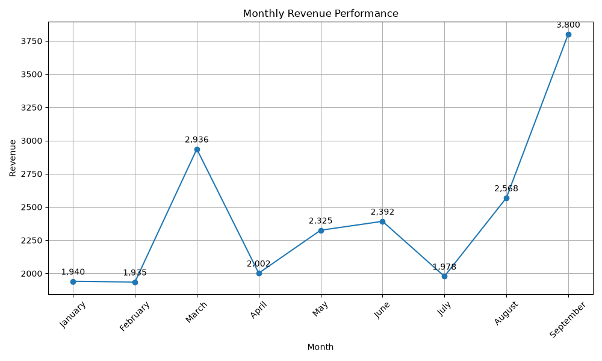
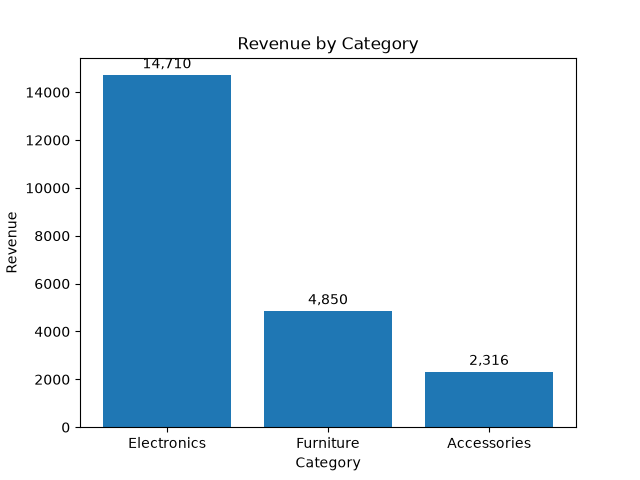
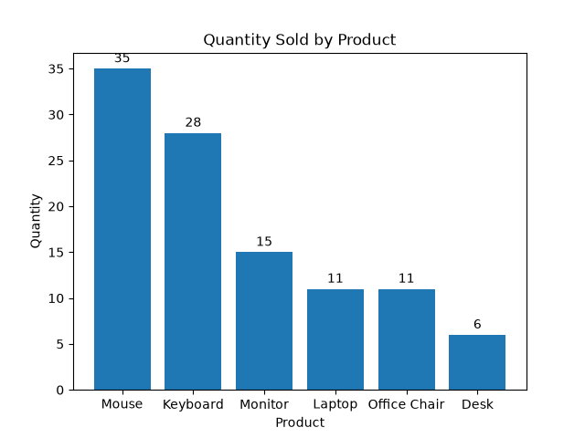
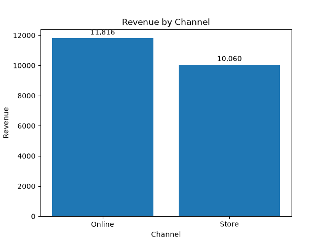
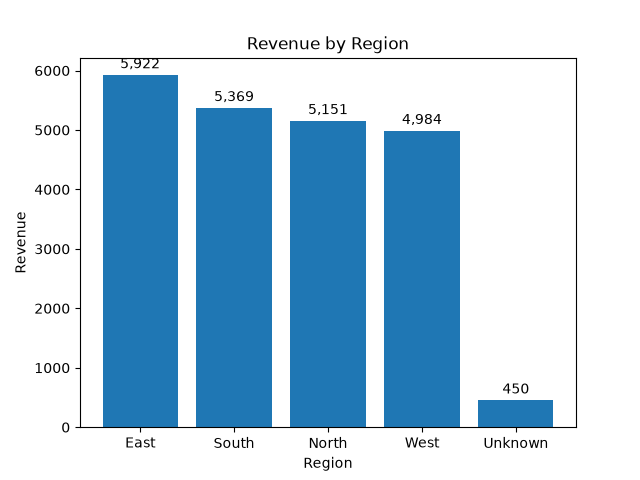

# Sales Analysis and Performance 

## Project Overview

This project analyzes sales performance using Python and Pandas. The analysis explores revenue, sales volume, product performance, categories, regions, sales channels, and monthly revenue throughout the analyzed period.

The project also includes data cleaning, exploratory data analysis (EDA), and data visualization to identify relevant patterns and insights in the sales dataset.

## Dataset 

The dataset contains sales transaction records used to analyze the company's sales performance.

The original dataset contains 49 rows and 9 columns. After the data cleaning process, the final dataset contains 48 rows and 9 columns.

The dataset covers the period from January to September 2026.

| Column | Description |
|---|---|
| `Order_ID` | Unique identifier for each order |
| `Date` | Date of the order |
| `Customer` | Customer associated with the order |
| `Product` | Product purchased |
| `Category` | Category of the product |
| `Quantity` | Number of units sold |
| `Unit_Price` | Price per unit |
| `Channel` | Sales channel |
| `Region` | Region associated with the order |

## Data Cleaning

The dataset was cleaned and prepared for analysis using Pandas.

The main cleaning steps included:

- Converting the Date column to datetime format.
- Replacing the missing Region value with Unknown when the region could not be determined from the available data.
- Removing the duplicated record.
- Validating missing values, duplicated rows, and data types after cleaning.
- Saving the cleaned dataset as sales_performance_cleaned.csv.

## Key Findings

- Electronics was the main revenue-generating category, generating $14,710, which represented 67.20% of total revenue during the analyzed period.
- Product sales volume did not directly correspond to revenue generation. The Mouse had the highest sales volume with 35 units sold, but generated only $965 in revenue. In contrast, the Laptop sold 11 units but generated $10,210 in revenue due to its substantially higher average selling price.
- Revenue was relatively balanced between the two sales channels. Online sales generated $11,816 (54.01%), while Store sales generated $10,060 (45.99%).
- September recorded the highest monthly revenue during the analyzed period, generating $3,800, while February recorded the lowest with $1,935. The analysis covers January through September 2026.
- East generated the highest regional revenue, with $5,922. The $450 classified as Unknown represents records where the region could not be determined and should not be interpreted as a separate geographic region.

## Visualizations

### Monthly Revenue Performance

### Revenue by Category

### Quantity Sold by Product

### Revenue by Channel

### Revenue by Region

